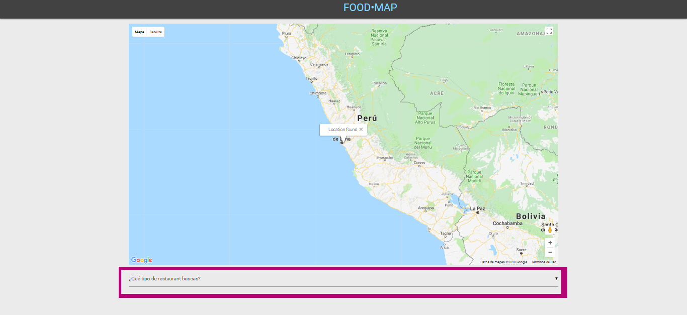
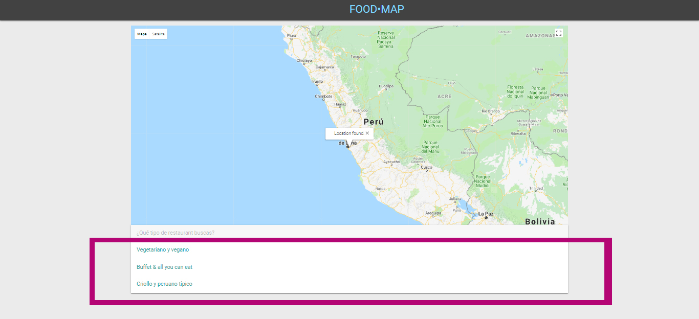
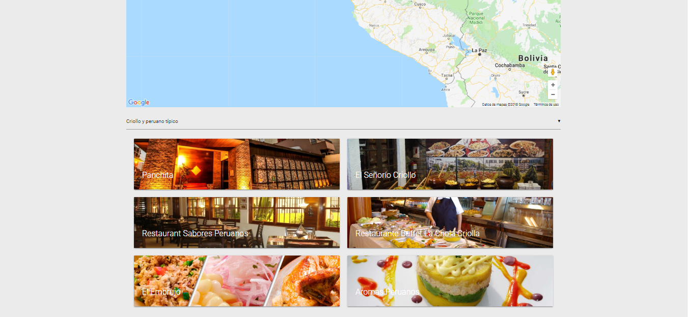
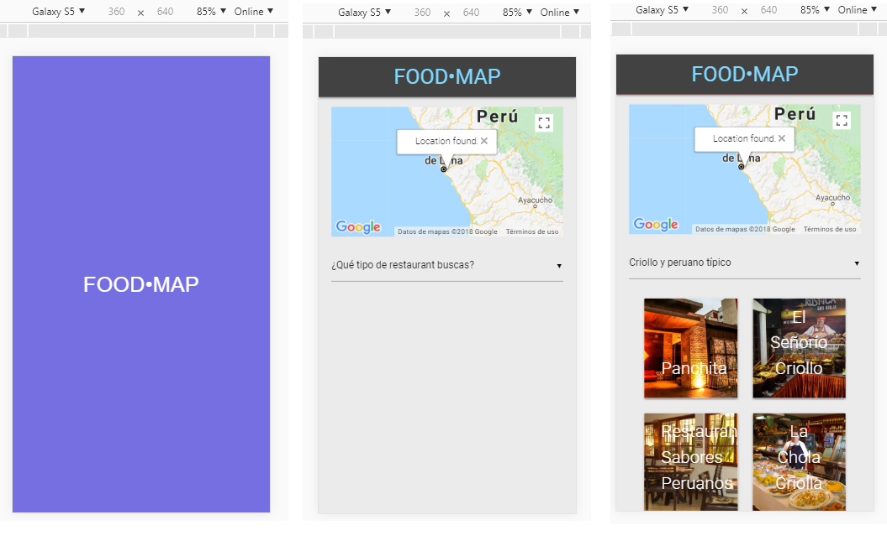

# FOOD • MAP

Web-app que filtra restaurants usando la API de Google Maps

### Flujo de la aplicación:

La web-app es responsive iniciando con un screen preload de 2 segundos seguido de la siguiente pantalla:

1. UBICACIÓN DONDE EL USUARIO ACCEDE A LA WEB Y VISUALIZACIÓN DEL SELECTOR 

2. VISUALIZACIÓN DE LAS OPCIONES A FILTRAR

3. CARGA DE TODAS LAS OPCIONES DE COMIDA

4. CARGA DEL MODAL CON LA INFORMACIÓN DE LA OPCIÓN ELEGIDA

### Visualización Mobile:

5. VISTAS DE LAS PANTALLAS EN MOBILE 

**Diseñado en 2018 para @Laboratoria**
